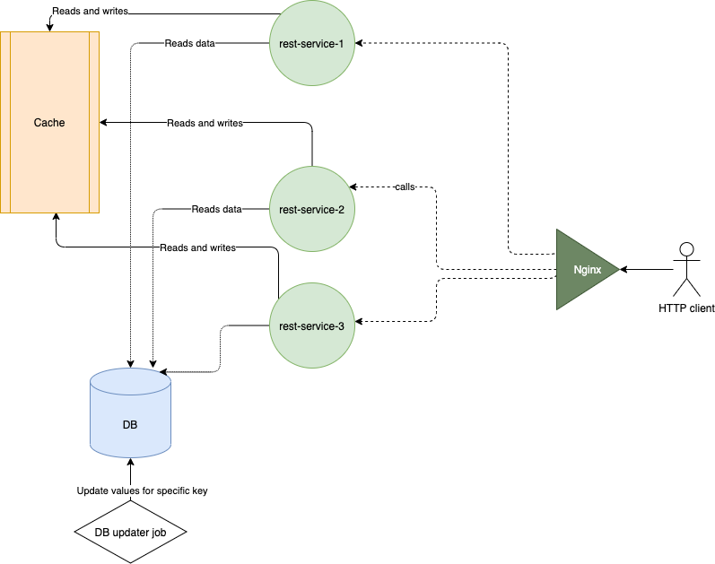
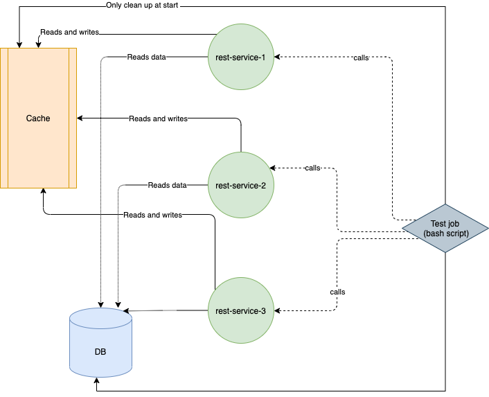

## How to start the project?

While being under project root folder 'caching-redis-poc', run the following
> sh start_project.sh

It will spin up the services pictured right below, including db_updater_job with the output similar to the following
```
...
Use 'docker scan' to run Snyk tests against images to find vulnerabilities and learn how to fix them
Creating docker_mysql-db_1 ... done
Creating docker_redis_1    ... done
Creating docker_rest-service_1 ... done
Creating docker_rest-service_2 ... done
Creating docker_rest-service_3 ... done
Creating docker_db_updater_service_1 ... done
Creating docker_nginx_1              ... done
Attaching to docker_db_updater_service_1, docker_nginx_1
db_updater_service_1  | +--------+---------+
db_updater_service_1  | | name   | counter |
db_updater_service_1  | +--------+---------+
db_updater_service_1  | | game_1 |       2 |
db_updater_service_1  | +--------+---------+
nginx_1               | /docker-entrypoint.sh: /docker-entrypoint.d/ is not empty, will attempt to perform configuration
nginx_1               | /docker-entrypoint.sh: Looking for shell scripts in /docker-entrypoint.d/
nginx_1               | /docker-entrypoint.sh: Launching /docker-entrypoint.d/10-listen-on-ipv6-by-default.sh
nginx_1               | 10-listen-on-ipv6-by-default.sh: info: Getting the checksum of /etc/nginx/conf.d/default.conf
nginx_1               | 10-listen-on-ipv6-by-default.sh: info: Enabled listen on IPv6 in /etc/nginx/conf.d/default.conf
nginx_1               | /docker-entrypoint.sh: Launching /docker-entrypoint.d/20-envsubst-on-templates.sh
nginx_1               | /docker-entrypoint.sh: Launching /docker-entrypoint.d/30-tune-worker-processes.sh
nginx_1               | /docker-entrypoint.sh: Configuration complete; ready for start up
db_updater_service_1  | +--------+---------+
db_updater_service_1  | | name   | counter |
db_updater_service_1  | +--------+---------+
db_updater_service_1  | | game_1 |       3 |
db_updater_service_1  | +--------+---------+
db_updater_service_1  | +--------+---------+
db_updater_service_1  | | name   | counter |
db_updater_service_1  | +--------+---------+
db_updater_service_1  | | game_1 |       4 |
db_updater_service_1  | +--------+---------+
db_updater_service_1  | +--------+---------+
db_updater_service_1  | | name   | counter |
db_updater_service_1  | +--------+---------+
db_updater_service_1  | | game_1 |       5 |
db_updater_service_1  | +--------+---------+
...
```

then it's possible to call the service by
> curl localhost:4000/game_1

## Architecture overview



The previous command starts the services:

1. A single instance of **MySQL** with a database score_db, which consists of a single table 'scores' ;
2. A single instance of **DB updater job**, based on bash script. The job increments existing value for a row with
   name 'game_1' in 'scores' every 5 seconds. Once incremented, current value is printed;
3. Single instance of **Redis** with default settings;
4. Three instances of Java **rest-service**s. The number can be changed in ./start_project.sh
5. An **Nginx** service, with default configuration, running on port 4000 , which passes requests to the rest-service
   API endpoint.

## How to talk to services?

There is a single API endpoint to communicate with and exposed via HTTP:
> http://localhost:4000/{key},

e.g. from the command line
> curl http://localhost:4000/game_1

should respond with a JSON similar to

> {"key":"game_1", "value":"5", status: "OK", message:"Found"}

## What should Proof-of-Concept demonstrate?

The reference architecture attempts to solve the race condition scenario, i.e. avoid a case at which a client (at the
pic, at the right)
can get an invalid result from the cache. A result is considered invalid if for two sequential events E1 and E2 (like
scoring first and second goals in hockey), the client receives the event E2, and after E1.

An example scenario of a race condition:

|Time|Data Master|1st client (C1)|2nd client (C2)|
|---|---|---|---|
|1|Puts E1 into DB| | |
|2| |C1 reads event E1 from DB| |
|3|Puts E2 into DB| | |
|4| | |C2 reads event E2 from DB |
|5a| | |C2 puts event E2 into cache|
|5b| |  | C2 returns E2 as a response to HTTP end client|
|5c | |  | HTTP end client sees E2 from the cache |
|6a| | C1 puts event E1 into cache |  |
|6b | | C1 returns E1 as a response to HTTP end client| | 
|6c | | HTTP end client sees E1 from the cache, when calls next |  |

In the end, from the HTTP end client, the events are seen in the order E2, E1 (at time 5c and 6c accordingly).

But the order is the opposite to real world order, thus can mislead the end client, which we want to avoid.

## Testing the race conditions scenarios

There are three scenarios for testing race condition. All three implemented as a bash script calling different services
inside docker avoiding nginx, i.e. calling each service directly.



### Scenario 1

Scenario tries to imitate a delay in one thread. It's tested with a single data entry named game_1 in MySQL

Can be started from the root folder with the command

> sh test_scenario_1.sh

|Time|Test job|1st client (C1)|2nd client (C2)|3rd client (C3)|MySQL state (event number)|Redis state (event number)|
|---|---|---|---|---|---|---|
|1a|Puts E1 into DB| | | | | |
|1b|Cleans up Redis| | | || |
|1c| | | | | 1| - |
|2a| | C1 reads the DB value E1 (in log 'Retrieved database value 1')| | || |
|2b| Noop for 1s to be sure E1 if read from DB | | || | |
|2c| | C1 sleeps for 6s in background (in log 'Waiting for 6000ms')| | || |
|3a|Updates DB with E2 instead of E1| | | || |
|3b| | | | |2| - |
|4a| | | C2 runs with no delay: reads E2 from DB (as redis is not filled yet by C1 with event E1) | || |
|4b| | | C2 sets E2 into Redis | || |
|4c| | | | | 2 | 2 |
|4d| | | C2 observes E2 on frontend, {"key":"game_1", "value":"2", status: "OK", message:"Found"} | || |
|5a| | | | C3 runs with no delay: reads E2 from DB (as redis is not filled yet by C1 with event E1) | || |
|5b| | | |  C3 sets E2 into Redis | || |
|5c| | | | | 2 | 2 |
|5d| | | | C3 observes E2 on frontend, {"key":"game_1", "value":"2", status: "OK", message:"Found"} | || |
|6| Noop for 5s in order to let C1 to get back form background with results | | || |
|7| | C1 observes E2 on frontend, {"key":"game_1", "value":"2", status: "OK", message:"Found"} | || |

### Scenario 2

The scenario is similar to the Scenario 1, but adds an extra step at the end emulating, that C1 has no key in Redis as
it expired already.

An example of log output for the scenario-2, when we have 2 clients, C1 is delayed for so much that the key(set by C2)
is expired, so nothing in Redis, and C1 doesn't write outdated E1 into Redis, but repeats the whole call again.

```
REST-SERVICE-1

[2021-04-29 21:12:34,792] c.o.p.d.MySqlService: mysql-db: started value lookup by key 'game_1'
[2021-04-29 21:12:34,928] c.o.p.d.MySqlService: mysql-db: finished value lookup [game_1 : 1] in 135594433ns (135ms): HIT
[2021-04-29 21:12:34,929] c.o.p.d.ScoreDataService: Retrieved database value '1'
[2021-04-29 21:12:34,929] c.o.p.d.ScoreDataService: Waiting for 6000ms
[2021-04-29 21:12:40,906] c.o.p.d.ScoreDataService: Woke up after 6000ms
[2021-04-29 21:12:40,907] c.o.p.d.RedisService: redis: Started updating Redis with [game_1 : 1]
[2021-04-29 21:12:40,924] c.o.p.d.RedisService: Potential concurrent modification of Redis key 'game_1' happened; transaction has been discarded.
[2021-04-29 21:12:40,934] c.o.p.d.MySqlService: mysql-db: started value lookup by key 'game_1'
[2021-04-29 21:12:41,150] c.o.p.d.MySqlService: mysql-db: finished value lookup [game_1 : 2] in 215194082ns (215ms): HIT
[2021-04-29 21:12:41,150] c.o.p.d.ScoreDataService: Retrieved database value '2'
[2021-04-29 21:12:41,150] c.o.p.d.ScoreDataService: Waiting for 6000ms
[2021-04-29 21:12:47,154] c.o.p.d.ScoreDataService: Woke up after 6000ms
[2021-04-29 21:12:47,154] c.o.p.d.RedisService: redis: Started updating Redis with [game_1 : 2]
[2021-04-29 21:12:47,159] c.o.p.d.RedisService: redis: Finished updating Redis for key (game_1) in 4462794ns (4ms): WRITE
[2021-04-29 21:12:47,166] i.b.j.i.r.RequestTimer: finished in 12423 ms
```

output from the scenario log

```
test_scenario_2_1     | SCENARIO-2
test_scenario_2_1     | 
test_scenario_2_1     | Cleaning mysql up...
test_scenario_2_1     | Mysql cleaned up.
test_scenario_2_1     | Adding an event to mysql...
test_scenario_2_1     | Added an event to mysql.
test_scenario_2_1     | Cleaning redis up...
test_scenario_2_1     | OK
test_scenario_2_1     | Redis cleaned up.
test_scenario_2_1     | Current value in MySql:
test_scenario_2_1     | +--------+---------+
test_scenario_2_1     | | name   | counter |
test_scenario_2_1     | +--------+---------+
test_scenario_2_1     | | game_1 |       1 |
test_scenario_2_1     | +--------+---------+
test_scenario_2_1     | Current value in Redis:
test_scenario_2_1     | 
test_scenario_2_1     | 
test_scenario_2_1     | Holding on all commands for 3 sec
test_scenario_2_1     | Started a delayed request with the service_1:
test_scenario_2_1     | Setting new value to MySql.
test_scenario_2_1     | New value has been set to MySql.
test_scenario_2_1     | Current value in MySql:
test_scenario_2_1     | +--------+---------+
test_scenario_2_1     | | name   | counter |
test_scenario_2_1     | +--------+---------+
test_scenario_2_1     | | game_1 |       2 |
test_scenario_2_1     | +--------+---------+
test_scenario_2_1     | Current value in Redis:
test_scenario_2_1     | 
test_scenario_2_1     | 
test_scenario_2_1     | Making request to service_2 (no delay):
test_scenario_2_1     | {"key":"game_1", "value":"2", status: "OK", message:"Found"}
test_scenario_2_1     | Current value in MySql:
test_scenario_2_1     | +--------+---------+
test_scenario_2_1     | | name   | counter |
test_scenario_2_1     | +--------+---------+
test_scenario_2_1     | | game_1 |       2 |
test_scenario_2_1     | +--------+---------+
test_scenario_2_1     | Current value in Redis:
test_scenario_2_1     | 2
test_scenario_2_1     | Imitate expired key in redis
test_scenario_2_1     | Cleaning redis up...
test_scenario_2_1     | OK
test_scenario_2_1     | Redis cleaned up.
test_scenario_2_1     | 
test_scenario_2_1     | Got result from rest-service-1 (delayed)
test_scenario_2_1     | {"key":"game_1", "value":"2", status: "OK", message:"Found"}
test_scenario_2_1     | Current value in MySql:
test_scenario_2_1     | +--------+---------+
test_scenario_2_1     | | name   | counter |
test_scenario_2_1     | +--------+---------+
test_scenario_2_1     | | game_1 |       2 |
test_scenario_2_1     | +--------+---------+
test_scenario_2_1     | Current value in Redis:
test_scenario_2_1     | 2

```

### Scenario 3

While data is updated MySql, thousands of requests are fired against each rest-service, which write the results into a
log file. The file is analyzed: it is being checked whether the cache had inconsistencies at any point in time, i.e.
earlier events appeared after later.

WIP

### Work to do

1. Grafana+prometheus ro monitor, analyze and improve the performance
2. Consider relaxing the redis watch/unwatch while reading a value from Redis.
