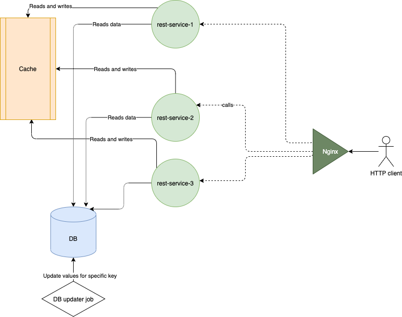

## How to start the project?

While being under project root folder 'caching-redis-poc', run the following
> sh start_project.sh

## Architecture overview

The previous command starts the services:

1. A single instance of **MySQL** with a database score_db, which consists of a single table 'scores' ;
2. A single instance of **DB updater job**, based on bash script. The job increments existing value for a row with
   name 'game_1_player_1' in 'scores' every 5 seconds. Once incremented, current value is printed;
3. Single instance of **Redis** with default settings;
4. Three instances of Java **rest-service**s. The number can be changed in ./start_project.sh
5. An **Nginx** service, with default configuration, running on port 4000 , which passes requests to the rest-service
   API endpoint.

## How to talk to services?

There is a single API endpoint to communicate with and exposed via HTTP:
> http://localhost:4000/{key},

e.g. from the command line
> curl http://localhost:4000/game_1_player_1

should respond with a JSON similar to

> {"key":"game_1_player_1", "value":"5", status: "OK", message:"Found"}

## What should Proof-of-Concept demonstrate?

The reference architecture attempts to solve the race condition scenario, i.e. avoid a case at which a client (at the
pic, at the right)
can get an invalid result from the cache. A result is considered invalid if for two sequential events E1 and E2 (like
scoring first and second goals in hockey), the client receives the event E2, and after E1.

An example scenario of a race condition:

|Time|Data Master|First client thread (C1)|Second client thread (C2)|
|---|---|---|---|
|1|Puts E1 into DB| | |
|2| |C1 reads event E1 from DB| |
|3|Puts E2 into DB| | |
|4| | |C2 reads event E2 from DB |
|5a| | |C2 puts event E2 into cache|
|5b| |  | C2 returns E2 as a response to HTTP end client|
|5c | |  | HTTP end client sees E2 from the cache |
|6a| | C1 puts event E1 into cache |  |
|6b | | C1 returns E1 as a response to HTTP end client| | 
|6c | | HTTP end client sees E1 from the cache, when calls next |  |

In the end, from the HTTP end client, the events are seen in the order E2, E1 (at time 5c and 6c accordingly).

But the order is the opposite to real world order, thus can mislead the end client, which we want to avoid.